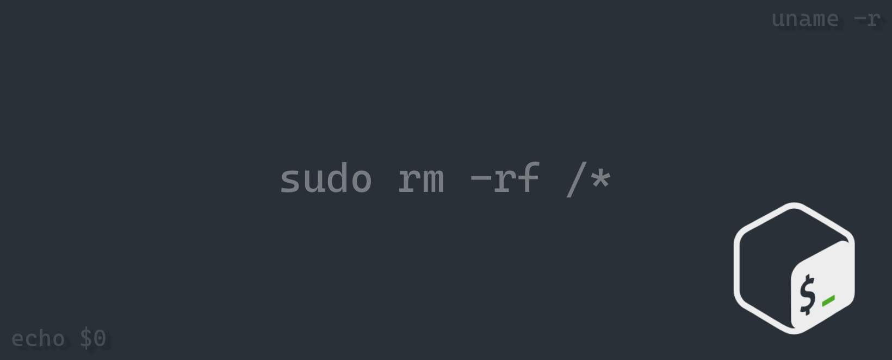

  

# About Me:

I’m currently working on `https://heloshop.vercel.app/` I’m currently learning `TypeScript, Machine Learning` All of my projects are available at `https://github.com/rimu-7` I regularly write articles on ` i'm working on my personal blog page` Ask me about react, mysql, python How to reach me `rrimu99@gmail.com` Know about my experiences `rimu-07.vercel.app` Fun fact `I'm cultivating a rich foundation of technical expertise.`

## Socials:

       

# Tech Stack:

                

# GitHub Stats:

 
 

### Top Contributed Repo

---

<picture>
  <source media="(prefers-color-scheme: dark)" srcset="https://raw.githubusercontent.com/me-js-bro/me-js-bro/output/github-snake-dark.svg" />
  <source media="(prefers-color-scheme: light)" srcset="https://raw.githubusercontent.com/me-js-bro/me-js-bro/output/github-snake.svg" />
  
</picture>

## 💰 You can help me by Donating

